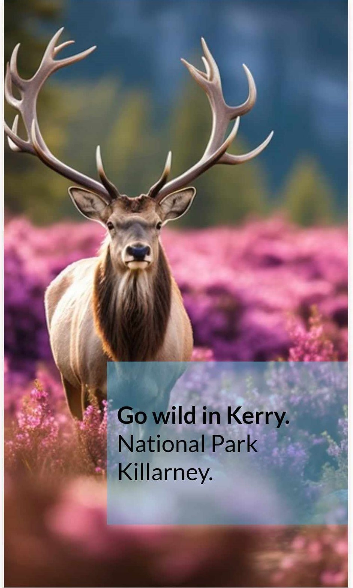
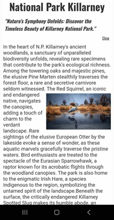
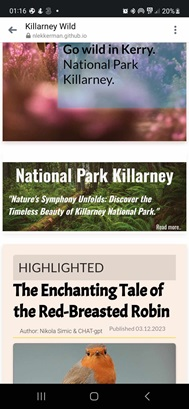
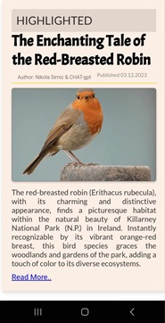
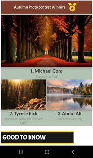
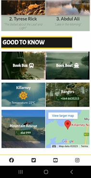

# Welcome to Killarney Wild

Explore the untamed beauty of Killarney National Park, Ireland, with Killarney Wild. Immerse yourself in captivating imagery, discover the diverse wildlife, and stay informed with essential information for a seamless experience. Join us in celebrating nature, conservation, and the enchanting stories that unfold in this natural haven.

## Table of Contents

- [Introduction](#introduction)
- [Goals](#goals)
- [Features](#features)
- [Usage](#usage)
- [License](#license)

## Goals for External Users

- **Community Building:** Create a welcoming space for users to share and discuss their wildlife experiences, fostering a sense of community among nature enthusiasts.

- **Interactive Learning:** Provide a platform for users to learn more about wildlife, conservation, and the natural beauty of Killarney National Park through interactive content.

- **User-Generated Content:** Encourage users to contribute their wildlife stories, photographs, and insights, showcasing the diverse experiences and perspectives within the community.

## Goals for Owners

- **Platform Enhancement:** Continuously improve and expand platform features to offer a seamless and enjoyable experience for users, keeping them engaged and motivated to contribute.

- **Conservation Impact:** Work towards leveraging the platform's influence to support local conservation initiatives, turning the community's passion into meaningful contributions for environmental preservation.

- **Strategic Partnerships:** Explore and establish partnerships with relevant organizations and stakeholders to enhance the platform's reach and impact, creating a broader network for nature lovers.

## Features

### Hero Section

 - **Striking Imagery**: Explore the beauty of Killarney National Park with captivating images featured in the hero section.

- **Inviting Taglines**: Engaging taglines invite visitors to "Go wild in Kerry" and explore the "National Park Killarney." 

### About National Park Killarney

- **Biodiversity Showcase**: Uncover the rich biodiversity of Killarney National Park amid ancient woodlands, featuring rare species. Read more for an immersive experience.

- **Nature's Wonders**: Embark on a journey through Killarney National Park's ancient woodlands and discover rare species. Click "Close" to hide the details.

### Highlights

- **Engaging Stories**: Dive into weekly features that unravel captivating tales of wildlife and nature in Killarney National Park. Each week brings new and fascinating narratives.

### Photo Contest Showcase

- **User Contributions**: Explore the stunning visuals captured by our community in the Autumn Photo Contest. Witness the beauty of Killarney through the lenses of fellow nature enthusiasts, showcasing the park's diverse landscapes and wildlife.

### Essential Information (Good to know)

- **Book Your Tours**: Easily plan your visit by booking bus and boat tours through our provided links. Discover the wonders of Killarney with expert guides.
- **Weather Updates**: Stay informed about the current weather in Killarney with real-time temperature updates. Enjoy your outdoor experience comfortably.

- **Emergency Contacts**: Save essential contact numbers for NP Rangers and Mountain Rescue. Your safety is our priority.
- **Map Your Location**: Explore Killarney National Park efficiently with our interactive map. Locate points of interest and navigate with ease.

### Impressions Section

- **Heartfelt Entries**: Read genuine and heartfelt impressions from visitors who have experienced the enchanting landscapes of Killarney National Park.

- **Global Perspectives**: Impressions come from visitors worldwide, offering diverse perspectives and experiences from places like New York, Toronto, Sydney, Seoul, Rome, and more.

- **Ode to Friendship**: A special section featuring a poetic "Ode to Friendship," celebrating the unique bond between humans and nature.

### Impression Form

- **User Contributions**: Contribute your own impressions and become part of the Killarney Wild community by sharing your name, email, country, city, and your unique impression of Killarney National Park.

- **Interactive Toggle**: Use the interactive toggle to reveal and hide the impression submission form, providing a clean and user-friendly interface.

- **Submission Validation**: Ensure all required fields are filled out with submission validation for name, email, country, city, and impression.

### Navigation

- **Responsive Design**: The website is designed to be responsive, ensuring a seamless and visually appealing experience across various devices and screen sizes.

- **Accessible Navigation**: The navigation menu is accessible and user-friendly, allowing visitors to easily explore different sections of the website.

### Social Media Integration

- **Social Links in Footer**: Connect with the Killarney Wild community through social media links in the footer, providing easy access to the Facebook, Twitter, YouTube, and Instagram pages.

- **FontAwesome Icons**: Stylish and recognizable FontAwesome icons enhance the visual appeal of social media links.

### General

- **Favicon**: A custom favicon adds a professional touch to the website, making it easily identifiable in browser tabs.

- **Stylesheet Integration**: The website features a well-organized and visually appealing stylesheet, enhancing the overall design and user experience.

# Future Features

1. **Weather Forecast Display:** Expand user experience with real-time weather info. Show temperature, wind speed, and humidity. Include icons for easy interpretation. Fetch data from a reliable weather API.

2. **User-Generated Content:** Foster community engagement. Allow users to share photos, wildlife sightings, and impressions. Showcase user-submitted photos in a gallery.

3. **Interactive Map:** Improve navigation. Embed an interactive map with key park locations, trails, and points of interest. Allow users to zoom, pan, and explore details interactively.

4. **Autumn Photo Contest:** Engage users with a seasonal photo competition. Encourage submissions capturing the beauty of Killarney in autumn. Involve a judging panel and offer prizes.

5. **Enhanced Accessibility:** Improve inclusivity. Implement voice commands for basic navigation. Provide alt text for images for screen reader accessibility. Optimize color contrast.

6. **Educational Content:** Enhance user knowledge. Provide informative articles or quizzes about the flora, fauna, and history of Killarney National Park.

7. **Wildlife Tracking:** Introduce a feature to track tagged wildlife. Users can receive notifications about recent sightings and contribute to conservation efforts.

8. **Virtual Tours:** Offer virtual experiences. Create 360-degree virtual tours of iconic park locations. Allow users to explore from the comfort of their homes.

9. **Mobile App Integration:** Develop a mobile app. Enable users to access key features on the go, receive push notifications, and contribute content seamlessly.

10. **Live Webcams:** Install live webcams at scenic spots. Allow users to view real-time footage of the park, enhancing their connection to nature.

11. **Nature Soundscape:** Provide an immersive experience. Include a section with audio recordings of the park's natural sounds, enhancing the website's ambiance.

12. **Guided Tours Booking:** Facilitate trip planning. Integrate a booking system for guided tours, helping visitors make the most of their Killarney experience.

13. **Seasonal Events Calendar:** Keep users informed. Display a calendar of seasonal events, festivals, and activities happening in Killarney National Park.

14. **Local Business Partnerships:** Support local businesses. Establish partnerships with nearby accommodations, restaurants, and adventure services for visitor convenience.

15. **Community Forum:** Build a sense of community. Introduce a forum for users to discuss park experiences, share tips, and connect with fellow nature enthusiasts.

16. **Conservation Initiatives:** Promote environmental awareness. Highlight ongoing conservation projects and encourage user contributions to support sustainability efforts.

17. **Nature Photography Workshops:** Offer educational opportunities. Organize workshops led by professional photographers to help users improve their nature photography skills.

18. **Camping Resources:** Facilitate camping trips. Provide resources such as camping guides, safety tips, and essential gear recommendations for park visitors.

19. **Social Media Integration:** Expand online presence. Integrate social media feeds to showcase the latest posts, updates, and user-generated content directly on the website.

20. **Visitor Feedback Surveys:** Gather insights for improvement. Periodically conduct visitor feedback surveys to understand user experiences and implement enhancements accordingly.

## Credits

### Images
- [Swan Image](https://www.freepik.com/free-photo/selective-focus-shot-magnificent-swans-swimming-pond-near-boat_11503009.htm#query=swan&position=8&from_view=search&track=sph&uuid=d542fe82-15e7-411b-a175-6337a74f97e0) by wirestock on Freepik
- [Dragonfly Image](https://www.freepik.com/free-photo/closeup-blue-damselflies-leaf-garden-sunlight_10990893.htm#query=dragonfly&position=5&from_view=search&track=sph&uuid=01c71d94-b717-4712-bcb7-06970520236a) by wirestock on Freepik
- [Fox Image](https://www.freepik.com/free-photo/shallow-focus-fox-forest_29175175.htm#query=fox&position=11&from_view=search&track=sph&uuid=ec1b788c-d87e-4bd4-aa97-1761330fde6b) by wirestock on Freepik
- [Wild Orchid Image](https://www.freepik.com/free-photo/pink-phalaenopsis-orchid-flower_1191302.htm#query=wild%20orchid&position=42&from_view=search&track=ais&uuid=6eceb235-3451-42ae-8c8f-3c0d9ab8f01e) by aopsan on Freepik
- [Nature Landscape Image](https://scontent.fdub6-1.fna.fbcdn.net/v/t1.6435-9/34756926_355818744822668_2150123811641491456_n.jpg?_nc_cat=104&ccb=1-7&_nc_sid=7a1959&_nc_ohc=BjSQD80sVDQAX9IrBFz&_nc_ht=scontent.fdub6-1.fna&oh=00_AfD5qcS8HsqWMUsP_IyCuv21P_isyHIgdpoj_kQOBYyJQQ&oe=6586EFC9) by Unsplash
- [Mountain Adventure Image](https://www.freepik.com/free-ai-image/driving-through-mountains-summer-adventure-awaits-ahead-generated-by-ai_42180452.htm#fromView=search&term=spy+nature&page=1&position=27&track=ais_ai_generated&regularType=ai&uuid=6150836d-846b-44f4-bb1b-7eb3a559ac8e) by vecstock on Freepik
- [Black and White Mountain Image](https://www.freepik.com/free-ai-image/black-white-mountain-background_47997122.htm#fromView=search&term=national+parks+logo&page=1&position=0&track=ais_ai_generated&regularType=ai&uuid=bc801c06-5ab9-45b3-9ad0-265c945954e6) by freepik on Freepik
- [Vibrant Flowers Image](https://www.freepik.com/free-ai-image/vibrant-flowers-bloom-tranquil-meadow-generated-by-ai_42129911.htm#fromView=search&term=wild+flowers&page=1&position=6&track=ais_ai_generated&regularType=ai&uuid=86e2cd12-1144-4486-bbd6-144e5fdf10cc) by vecstock on Freepik
- [Lake Sunrise Image](https://www.freepik.com/free-photo/lake-fog-sunrise-with-autumn-foliage-mountains-new-england-stowe_30071761.htm#query=autumn&position=43&from_view=search&track=sph&uuid=3f2a173e-227d-4d37-81c3-d646701271e4) by TravelScape on Freepik
- [Oak Leaf Image](https://www.freepik.com/free-photo/selective-focus-shot-oak-leaf-illuminated-by-golden-light-autumn-sunset-forest_19538511.htm#page=2&query=autumn&position=2&from_view=search&track=sph&uuid=f30418b3-15a1-4b35-90b4-f716a04edec8) by wirestock on Freepik
- [Vibrant Autumn Leaves Image](https://www.freepik.com/free-photo/vibrant-autumn-leaves-illuminate-tranquil-forest-dusk-generated-by-ai_41205925.htm#query=autumn&position=35&from_view=search&track=sph&uuid=3f2a173e-227d-4d37-81c3-d646701271e4) by vecstock on Freepik
- [Heron Image](https://www.freepik.com/free-ai-image/view-wild-bird_65693658.htm#fromView=search&term=heron&page=1&position=0&track=ais_ai_generated&regularType=ai) by freepik on Freepik
- [Wild Elk Image](https://www.freepik.com/free-ai-image/wild-elk-nature-with-wilderness-landscape_78536455.htm#fromView=search&term=deer+fight&page=1&position=11&track=ais_ai_generated&regularType=ai) by freepik on Freepik
- [Fern Image](https://www.freepik.com/free-ai-image/abstract-creative-3d-sphere-with-vegetation_72442070.htm#fromView=search&term=fern&page=1&position=32&track=ais_ai_generated&regularType=ai) by freepik on Freepik
- [Backpacker Image](https://www.freepik.com/free-ai-image/standing-backpacker-mountain-peak-achieving-success-generated-by-ai_43018009.htm#fromView=search&term=explore&page=1&position=3&track=ais_ai_generated&regularType=ai) by stockgiu on Freepik
- [Mushroom Image](https://www.freepik.com/free-photo/closeup-selective-focus-shot-wild-mushroom-with-water-drops-it-growing-forest_11183221.htm#query=glowing%20mushrooms&position=41&from_view=search&track=ais&uuid=9a61896e-2af8-456c-9e7b-39b7ea322723) by wirestock on Freepik
- [Butterfly Image] (https://www.freepik.com/free-photo/papilio-machaon-with-its-vibrant-colors_13901656.htm#query=butterfly&position=16&from_view=search&track=sph&uuid=65c74471-71fe-4686-84d

**Acknowledgments:**  
- Special thanks to CHAT-gpt for assistance with textual content and speeding up the coding process.  
- Additional credits to Code Institute's Love Running App for their inspiration in developing the Killarney Wild, and footer section  part code.
